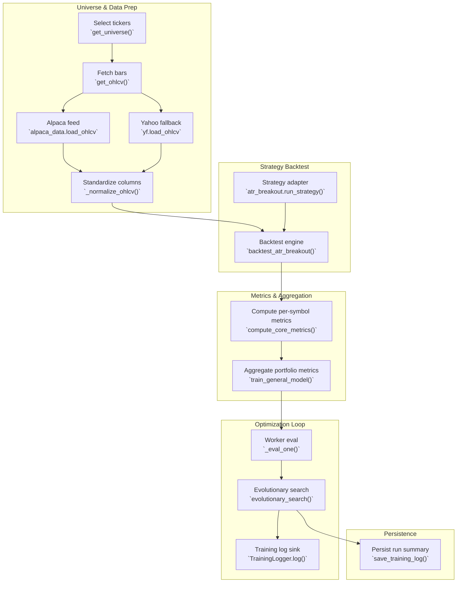

# Data Input & Training Flow

The diagram below follows a typical training run that starts with choosing a ticker universe, pulls price history, runs a strategy backtest per symbol, aggregates metrics, and finally feeds the optimization loop and training logs.

## Stage-by-stage callouts

- **Universe selection** – UI or automation picks a symbol set via `get_universe`, which loads index membership from JSON and returns the ticker list that the trainer will iterate.【F:src/data/universe.py†L1-L27】
- **Data ingestion** – For each symbol the trainer calls `get_ohlcv`, which widens the requested date window, tries Alpaca first via `alpaca_data.load_ohlcv`, falls back to Yahoo Finance, and normalizes/standardizes the OHLCV frame through `_normalize_ohlcv`.【F:src/data/loader.py†L15-L134】
- **Strategy execution** – The generic trainer imports a `run_strategy` callable (e.g., the ATR breakout adapter) that forwards parameters into `backtest_atr_breakout`, where historical bars drive the state machine that builds equity curves and trade records.【F:src/models/general_trainer.py†L23-L145】【F:src/models/atr_breakout.py†L1-L38】【F:src/backtest/engine.py†L1-L200】
- **Metric extraction & aggregation** – After each backtest, `compute_core_metrics` summarizes returns, drawdown, Sharpe, trade diagnostics, and more. `train_general_model` also normalizes equity curves, forms an equal-weight aggregate, and injects trade-activity rollups (weighted holding period, win-rate, expectancy) into the portfolio-level metrics that downstream selection logic relies on.【F:src/backtest/metrics.py†L1-L174】【F:src/models/general_trainer.py†L72-L145】
- **Optimization loop** – `_eval_one` wraps the trainer so the evolutionary search can evaluate parameter sets in parallel, while `_clamped_fitness` and the `evolutionary_search` loop apply activity gates, compute scores, and stream telemetry/logging for each generation.【F:src/optimization/evolutionary.py†L1-L420】
- **Run telemetry & persistence** – The evolutionary loop and other trainers use `TrainingLogger` to append JSONL events, and completed runs can be saved to disk for later review through `save_training_log`.【F:src/utils/training_logger.py†L1-L42】【F:src/storage.py†L257-L284】

Use this diagram as a quick reference when wiring new data providers, adding strategies, or extending the optimizer—the callouts show exactly where each concept lives in the codebase.
